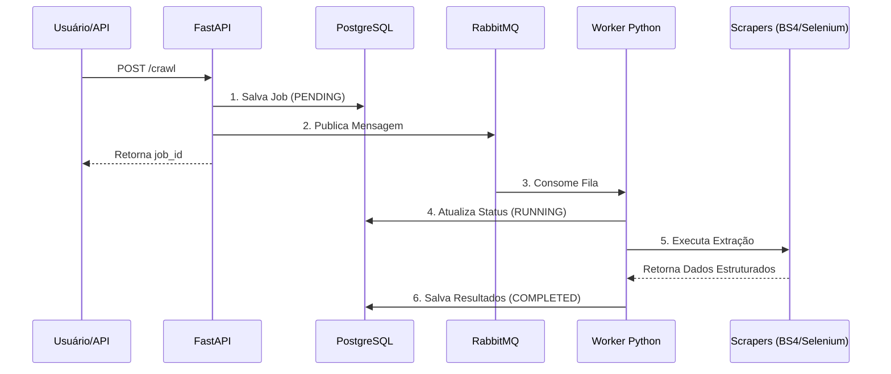

# Teste Técnico - Desenvolvedor Senior RPA

## Contexto e Objetivo

Este repositório contém a solução para o desafio técnico de RPA. O objetivo é desenvolver um sistema de coleta de dados que extrai informações de múltiplas fontes web (estáticas e dinâmicas), gerencia jobs através de filas de mensagens e disponibiliza os dados via API REST, com infraestrutura totalmente conteinerizada.

## Arquitetura Implementada

Para garantir escalabilidade e evitar o bloqueio da API durante tarefas pesadas de extração, o projeto implementa o padrão **Producer-Consumer** utilizando um message broker assíncrono.



## Stack Tecnológica

| Tecnologia | Uso no Projeto |
|------------|-----|
| **FastAPI / Pydantic** | API REST assíncrona e validação de dados |
| **SQLAlchemy** | ORM para persistência de dados |
| **PostgreSQL** | Banco de dados relacional |
| **RabbitMQ / aio_pika** | Sistema de mensageria e filas (Broker) |
| **Selenium / BS4** | Extração de páginas dinâmicas e estáticas |
| **Docker Compose** | Orquestração da infraestrutura local |
| **Pytest** | Cobertura de testes automatizados |

## Como Executar o Projeto

A infraestrutura foi desenhada para inicializar com um único comando, abstraindo a necessidade de dependências locais (o Selenium roda em um container dedicado).

1. Clone este repositório.
2. Na raiz do projeto, execute:

```bash
docker-compose up -d --build
```

A documentação interativa da API (Swagger) estará disponível em:
**http://localhost:8000/docs**

Para acompanhar o processamento das filas em tempo real, utilize:
```bash
docker logs -f rpa_worker
```

## Endpoints da API

A aplicação expõe as seguintes rotas assíncronas principais:

**Agendamento:**
- `POST /crawl/{target}`: Agenda a coleta para `hockey`, `oscar` ou `all`. Retorna o `job_id` imediatamente.

**Gerenciamento e Resultados:**
- `GET /jobs`: Lista o histórico de jobs.
- `GET /jobs/{job_id}/results`: Retorna os dados coletados assim que o status do job mudar de `PENDING` ou `RUNNING` para `COMPLETED`.

## Decisões Técnicas e Resiliência

1. **Tratamento de Stale Elements:** O scraper dinâmico implementa um padrão de *retry* para contornar exceções do tipo `StaleElementReferenceException`, comuns em sites renderizados via JavaScript/AJAX.
2. **Message Acknowledgement:** O consumidor do RabbitMQ utiliza gerenciamento manual de confirmação (`ack`/`nack`). Em caso de falha de processamento, a mensagem é devolvida à fila de forma segura.
3. **Graceful Degradation:** Campos numéricos vazios no HTML (comuns na tabela do Oscar) são mapeados proativamente para `0` para evitar falhas de conversão de tipo (`ValueError`).
4. **Isolamento de Testes:** A suíte utiliza injeção de dependências para substituir a conexão com o banco por uma instância SQLite `StaticPool` em memória, além de realizar *mocks* do publicador do RabbitMQ, garantindo testes determinísticos e rápidos.

## Testes Automatizados

Para rodar a suíte de testes localmente (requer Python configurado no host):

```bash
pip install -r requirements.txt
pip install pytest httpx
pytest -v
```

## Integração e Entrega Contínuas (CI/CD)

O repositório conta com um pipeline configurado via GitHub Actions (`.github/workflows/main.yml`). A cada push ou pull request para a branch `main`, o workflow executa automaticamente as seguintes etapas:

1. **Linting:** Validação estática do código utilizando o `Ruff`.
2. **Testes:** Execução da suíte de testes unitários e de integração com `pytest`.
3. **Deploy (Build e Push):** Construção da imagem Docker e envio para o Google Container Registry (GCR).

> **Nota sobre a execução em forks:** Para que a etapa de deploy (push para o GCR) execute com sucesso em um ambiente clonado ou fork, é obrigatório configurar as Secrets `GCP_PROJECT_ID` e `GCP_SA_KEY` (contendo o JSON da Service Account com permissões adequadas) na aba *Secrets and variables* do repositório no GitHub. Sem essas credenciais, as etapas de Lint e Testes passarão normalmente, mas o push será interrompido por questões de segurança e permissão.